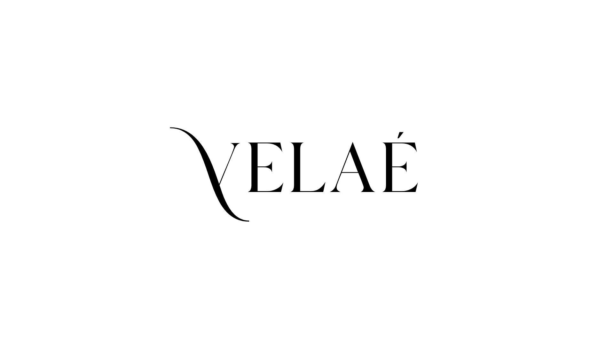

  

# Velaé Brasil Site Oficial | VELAÉ

     <a href="https://icarojordano.github.io/velae/">📱 Visite o Projeto</a>

## 📝 Descrição do Projeto

O Projeto VELAÉ uma loja virtual fictícia de artigos de luxo, desenvolvida com foco em design, identidade visual e experiência do usuário. Inspirado nas grandes maisons de moda, o site destaca bolsas e acessórios de marcas premium, trazendo uma atmosfera elegante, tecnológica e moderna.

Este projeto tem como objetivo principal apresentar o estilo e os valores da marca VELAÉ, explorando conceitos de UI/UX refinados, animações sutis, tipografia de alto padrão e uma composição visual sofisticada. É um projeto visual com múltiplas camadas que simula uma vitrine de luxo digital, mais voltado à estética e branding do que a funcionalidades completas de e-commerce.

Ideal para demonstrar habilidades em construção de interfaces impactantes, atenção a detalhes visuais e aplicação de boas práticas de front-end moderno.

---

### O que esse projeto resolve

- Apresentar o estilo e os valores da marca VELAÉ
- Organiza produtos de forma clara e acessível  
- Torna o processo de compra mais rápido e objetivo  
- Elimina a necessidade de login ou sistemas complexos

## 💻 Tech Stack

<!--- # "Verify icons availability here https://github.com/tandpfun/skill-icons" -->

<h2 id="layout">🎨 Layout</h2>

    

## 🧩 Features

- [x] Design Responsivo: Layout adaptável para dispositivos móveis, tablets e desktops.
- [X] Catálogo de Produtos: Exibição de velas artesanais com imagens e descrições detalhadas.
- [X] Navegação Intuitiva: Menu de navegação claro e acessível para fácil exploração do site.
- [X] Estética Atraente: Uso de paleta de cores suaves e tipografia elegante para uma experiência visual agradável.
- [X] Informações de Contato: Seção dedicada com informações para contato e redes sociais.

<h2 id="colab">🤝 Collaborators</h2>

Agradecimento especial a todas as pessoas que contribuíram para este projeto.

<table>
  <tr>
    <td align="center">
      <a href="https://www.linkedin.com/in/icaro-jordano/">
         
        
          <b>Icaro Jordano | Desenvolvedor 
            e Tech Manager</b>
        
      </a>
    </td>
    <td align="center">
      <a href="https://www.linkedin.com/in/rosaliceng/">
         
        
          <b>Rosalice Nogueira | Designer and creator of the brand’s visual identity.</b>
        
      </a>
    </td>
  </tr>
</table>
